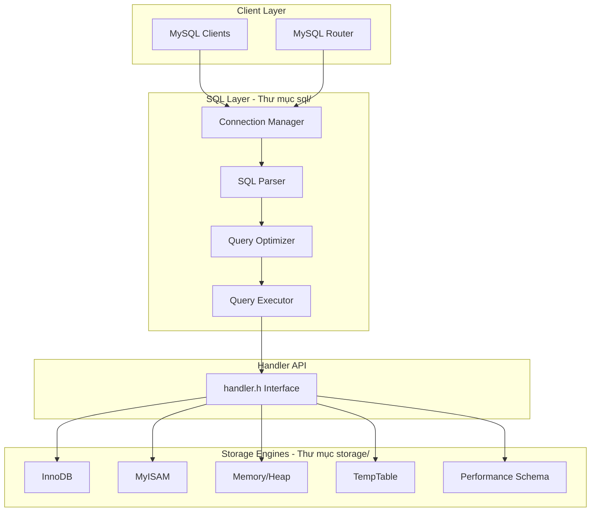

# Lộ Trình Học MySQL Server Toàn Diện (12 Tháng)

## Tổng Quan Kiến Trúc MySQL Server

## Lộ Trình Tổng Quan

| Giai đoạn | Thời gian | Nội dung | Tài liệu chi tiết |
|-----------|-----------|----------|-------------------|
| Phần 1 | Tháng 1-2 | Nền tảng C/C++ & Setup | [phase1-foundation.md](docs/intern-guide/phase1-foundation.md) |
| Phần 2 | Tháng 3 | Tổng quan SQL Layer | [phase2-sql-overview.md](docs/intern-guide/phase2-sql-overview.md) |
| Phần 2 | Tháng 4-5 | SQL Parser Deep Dive | [phase3-parser.md](docs/intern-guide/phase3-parser.md) |
| Phần 2 | Tháng 6 | Query Optimizer | [phase4-optimizer.md](docs/intern-guide/phase4-optimizer.md) |
| Phần 2 | Tháng 7 | Query Executor | [phase5-executor.md](docs/intern-guide/phase5-executor.md) |
| Phần 2 | Tháng 8 | Handler API | [phase6-handler.md](docs/intern-guide/phase6-handler.md) |
| Phần 3 | Tháng 9-10 | InnoDB Deep Dive | [phase7-innodb.md](docs/intern-guide/phase7-innodb.md) |
| Phần 3 | Tháng 11 | MyISAM, Memory, TempTable | [phase8-other-engines.md](docs/intern-guide/phase8-other-engines.md) |
| Phần 3 | Tháng 12 | Tổng hợp & Dự án | [phase9-final.md](docs/intern-guide/phase9-final.md) |

## Checklist Đánh Giá Tiến Độ

| Tháng | Milestone |
|-------|-----------|
| 2 | Build MySQL thành công, chạy local server |
| 3 | Trace được luồng xử lý query cơ bản |
| 5 | Hiểu SQL Parser và có thể đọc grammar rules |
| 6 | Hiểu Query Optimizer và sử dụng EXPLAIN |
| 8 | Hiểu Handler API và Iterator execution |
| 10 | Hiểu InnoDB internals (Buffer Pool, B+Tree, MVCC) |
| 11 | Hiểu MyISAM, Memory, TempTable |
| 12 | Hoàn thành dự án tổng kết |

## Tài Nguyên Học Tập

### Sách
- "C++ Primer" (Lippman) - Cho phần C++
- "High Performance MySQL" (Schwartz)
- "Database Internals" (Petrov)

### Online
- [MySQL Documentation](https://dev.mysql.com/doc/refman/en/)
- [learncpp.com](https://www.learncpp.com/) - Học C++
- Planet MySQL Blog

### Tools
- Visual Studio 2022 (Windows)
- CMake 3.17.5+
- MySQL Workbench

