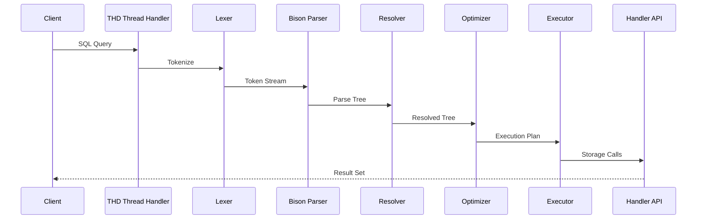

# Giai Đoạn 2: Tổng Quan SQL Layer (Tháng 3)

## Mục Tiêu
- Hiểu luồng xử lý một SQL query từ đầu đến cuối
- Làm quen với các file quan trọng trong thư mục `sql/`
- Có thể trace code khi chạy query đơn giản

---

## Kiến Trúc SQL Layer



---

## Các File Quan Trọng

### Core Files

| File | Chức năng | Độ ưu tiên đọc |
|------|-----------|----------------|
| `sql/sql_class.h` | THD class definition | Cao |
| `sql/sql_class.cc` | THD implementation | Cao |
| `sql/sql_parse.cc` | Command dispatcher | Cao |
| `sql/sql_lex.h` | Lexer structures | Trung bình |
| `sql/sql_yacc.yy` | Bison grammar | Trung bình |

### THD - Thread Handler

THD (Thread Handler Descriptor) là class trung tâm, chứa tất cả context của một connection:

```cpp
class THD {
    LEX *lex;                    // Current statement
    Query_arena *stmt_arena;     // Memory arena
    Protocol *protocol;          // Client protocol
    Security_context security_ctx; // User privileges
    // ... nhiều fields khác
};
```

**Tìm THD trong code:**
```
sql/sql_class.h  - Line ~1000-3000
```

### Dispatcher - sql_parse.cc

Function chính xử lý command:
```cpp
bool dispatch_command(THD *thd, const COM_DATA *com_data, 
                      enum enum_server_command command);
```

**Flow:**
1. Nhận command từ client
2. Switch theo command type (COM_QUERY, COM_PING, ...)
3. Gọi mysql_parse() cho COM_QUERY
4. Trả kết quả về client

---

## Bài Tập Thực Hành

### Bài 1: Trace SELECT 1

**Mục tiêu:** Hiểu luồng xử lý query đơn giản nhất

**Các bước:**
1. Mở Visual Studio, load MySQL solution
2. Đặt breakpoint tại `dispatch_command()` trong `sql/sql_parse.cc`
3. Chạy mysqld trong Debug mode
4. Từ mysql client, chạy: `SELECT 1;`
5. Step through và ghi lại call stack

**Expected call stack:**
```
dispatch_command()
  └── mysql_parse()
      └── parse_sql()
          └── MYSQLparse() [generated from sql_yacc.yy]
      └── mysql_execute_command()
          └── Sql_cmd_select::execute()
              └── handle_query()
```

**Ghi chép:**
- Screenshot call stack tại mỗi điểm quan trọng
- Note lại các biến quan trọng (lex->sql_command, thd->query())

### Bài 2: Trace Connection Flow

**Mục tiêu:** Hiểu luồng khi client connect

**Breakpoints:**
1. `handle_connection()` - sql/conn_handler/connection_handler_per_thread.cc
2. `check_connection()` - sql/sql_connect.cc
3. `acl_authenticate()` - sql/auth/sql_authentication.cc

**Câu hỏi cần trả lời:**
- [ ] Khi nào THD được tạo?
- [ ] Authentication xảy ra ở đâu?
- [ ] Thread pool hoạt động như thế nào?

### Bài 3: Vẽ Sơ Đồ

**Mục tiêu:** Tổng hợp kiến thức thành diagram

Vẽ sơ đồ chi tiết cho:
1. Connection establishment flow
2. Query execution flow (SELECT)
3. File locations cho mỗi component

---

## Khái Niệm Quan Trọng

### LEX Structure

LEX chứa kết quả parsing của một statement:
```cpp
struct LEX {
    enum_sql_command sql_command;  // SELECT, INSERT, UPDATE...
    Query_block *query_block;      // Main query block
    Table_ref *query_tables;       // Tables involved
    // ...
};
```

### Query_block

Đại diện cho một SELECT statement (hoặc subquery):
```cpp
class Query_block {
    mem_root_deque<Item *> fields;  // SELECT list
    Table_ref *table_list;          // FROM clause
    Item *where_cond;               // WHERE clause
    ORDER *order_list;              // ORDER BY
    // ...
};
```

### Item Hierarchy

Mọi expression đều là Item:
```
Item (base)
├── Item_field        // Column reference
├── Item_int          // Integer literal
├── Item_string       // String literal
├── Item_func         // Functions
│   ├── Item_func_plus
│   ├── Item_func_eq
│   └── ...
└── Item_subselect    // Subquery
```

---

## Checklist Cuối Tháng 3

- [ ] Trace được `SELECT 1;` từ đầu đến cuối
- [ ] Hiểu vai trò của THD
- [ ] Biết dispatch_command() làm gì
- [ ] Hiểu cấu trúc LEX cơ bản
- [ ] Vẽ được sơ đồ luồng xử lý query
- [ ] Biết Item là gì

---

## Tài Liệu Tham Khảo

- `sql/README` - Nếu có
- Source code comments trong sql_parse.cc
- MySQL Internals Manual - Query Execution

