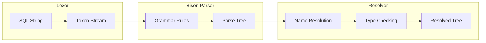

# Giai Đoạn 3: SQL Parser Deep Dive (Tháng 4-5)

## Mục Tiêu
- Hiểu cách MySQL parse SQL statement thành parse tree
- Đọc hiểu Bison grammar rules
- Trace được parsing của query phức tạp

---

## Kiến Trúc Parser



---

## Files Quan Trọng

| File | Chức năng | Lines |
|------|-----------|-------|
| `sql/sql_yacc.yy` | Grammar rules | ~15,000 |
| `sql/sql_lex.cc` | Lexer implementation | ~3,000 |
| `sql/sql_lex.h` | Lexer structures | ~2,500 |
| `sql/parse_tree_nodes.h` | Parse tree nodes | ~4,000 |
| `sql/parse_tree_items.h` | Expression nodes | ~1,000 |
| `sql/item.h` | Item base class | ~6,000 |
| `sql/item.cc` | Item implementation | ~10,000 |

---

## Tháng 4: Lexer & Basic Grammar

### Lexer - Tokenization

Lexer chuyển SQL string thành tokens:
```
"SELECT id FROM users" 
    → [SELECT_SYM] [IDENT "id"] [FROM] [IDENT "users"]
```

**File:** `sql/sql_lex.cc`
- `MYSQLlex()` - Main lexer function
- `lex_one_token()` - Tokenize một token

**Token types:** Định nghĩa trong `sql/sql_yacc.yy`
```yacc
%token SELECT_SYM
%token INSERT_SYM
%token UPDATE_SYM
%token DELETE_SYM
%token FROM
%token WHERE
// ... 500+ tokens
```

### Bison Grammar Basics

**File:** `sql/sql_yacc.yy`

Cấu trúc một rule:
```yacc
select_stmt:
    query_expression
    {
      $$ = NEW_PTN PT_select_stmt($1);
    }
  ;

query_expression:
    query_expression_body opt_order_clause opt_limit_clause
    {
      $$ = NEW_PTN PT_query_expression($1, $2, $3);
    }
  ;
```

**Giải thích:**
- `select_stmt`, `query_expression` là non-terminals
- `{ ... }` là action code (C++)
- `$$` là kết quả của rule
- `$1`, `$2` là các components
- `NEW_PTN` tạo parse tree node

### Bài Tập Tháng 4

#### Bài 1: Đọc 10 Rules Cơ Bản
Tìm và hiểu các rules sau trong `sql_yacc.yy`:
1. `select_stmt`
2. `insert_stmt`
3. `update_stmt`
4. `delete_stmt`
5. `where_clause`
6. `table_reference`
7. `column_ref`
8. `literal`
9. `expr`
10. `simple_expr`

#### Bài 2: Trace SELECT Parsing
Query: `SELECT a, b FROM t WHERE x = 1`

**Breakpoints:**
1. `MYSQLlex()` - Xem từng token
2. `MYSQLparse()` - Entry point
3. Constructor của `PT_select_stmt`

**Ghi lại:**
- Danh sách tokens
- Parse tree structure
- Item types cho expressions

#### Bài 3: Token Identification
Cho query: `SELECT COUNT(*) FROM orders WHERE status = 'pending' AND total > 100`

Liệt kê tất cả tokens sẽ được tạo.

---

## Tháng 5: Advanced Parsing

### Parse Tree Nodes

**File:** `sql/parse_tree_nodes.h`

```cpp
class PT_select_stmt : public Parse_tree_root {
    PT_query_expression *m_qe;
    // ...
};

class PT_query_expression : public Parse_tree_node {
    PT_query_expression_body *m_body;
    PT_order *m_order;
    PT_limit_clause *m_limit;
};
```

### Item Hierarchy

Mọi expression là một Item:

```
Item (abstract base)
├── Item_ident
│   ├── Item_field          // column reference
│   └── Item_ref             // alias reference
├── Item_num
│   ├── Item_int
│   ├── Item_real
│   └── Item_decimal
├── Item_string
├── Item_func               // functions
│   ├── Item_func_plus      // a + b
│   ├── Item_func_minus     // a - b
│   ├── Item_func_eq        // a = b
│   ├── Item_cond_and       // a AND b
│   └── Item_cond_or        // a OR b
└── Item_subselect          // subquery
```

### Bài Tập Tháng 5

#### Bài 1: Trace JOIN Query
Query: `SELECT u.name, o.total FROM users u JOIN orders o ON u.id = o.user_id WHERE o.total > 100`

**Tasks:**
1. Vẽ parse tree
2. Identify Item types cho mỗi expression
3. Trace name resolution

#### Bài 2: Trace Subquery
Query: `SELECT * FROM users WHERE id IN (SELECT user_id FROM orders WHERE total > 1000)`

**Tasks:**
1. Tìm PT_subquery
2. Hiểu cách nested query blocks được tạo
3. Trace Item_in_subselect

#### Bài 3: Thêm Keyword (Experimental)

**Mục tiêu:** Thêm keyword `HELLO` in ra "Hello World"

**Bước 1:** Thêm token trong `sql_yacc.yy`
```yacc
%token HELLO_SYM
```

**Bước 2:** Thêm rule
```yacc
hello_stmt:
    HELLO_SYM
    {
      $$ = NEW_PTN PT_hello_stmt();
    }
  ;
```

**Bước 3:** Implement PT_hello_stmt

> Lưu ý: Đây là bài tập thử nghiệm, không commit vào main branch

---

## Checklist Cuối Tháng 5

- [ ] Hiểu lexer tokenization
- [ ] Đọc được Bison grammar rules
- [ ] Trace được SELECT, INSERT parsing
- [ ] Hiểu Item hierarchy
- [ ] Biết parse tree structure
- [ ] Trace được JOIN và subquery

---

## Tips Debug Parser

1. **Print tokens:**
   ```cpp
   // Trong MYSQLlex()
   printf("Token: %d\n", token);
   ```

2. **Print parse tree:**
   Sử dụng `DBUG_PRINT` có sẵn

3. **Bison debug mode:**
   ```
   cmake -DWITH_DEBUG=1 ..
   ```
   Và set `yydebug = 1`

