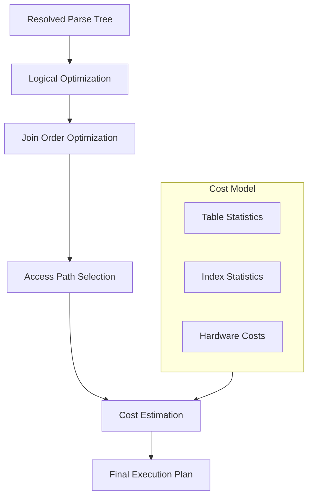

# Giai Đoạn 4: Query Optimizer (Tháng 6)

## Mục Tiêu
- Hiểu cost-based optimization
- Biết cách MySQL chọn execution plan
- Sử dụng EXPLAIN để phân tích query

---

## Kiến Trúc Optimizer



---

## Files Quan Trọng

| File | Chức năng |
|------|-----------|
| `sql/sql_optimizer.cc` | Main optimizer entry |
| `sql/sql_planner.cc` | Join planning |
| `sql/opt_range.cc` | Range optimization |
| `sql/opt_costmodel.cc` | Cost calculations |
| `sql/opt_hints.cc` | Optimizer hints |
| `sql/opt_explain.cc` | EXPLAIN output |
| `sql/opt_trace.cc` | Optimizer trace |

---

## Khái Niệm Quan Trọng

### 1. Cost-Based Optimization

MySQL ước tính cost cho mỗi plan và chọn plan có cost thấp nhất.

**Cost factors:**
- `io_cost` - Disk I/O
- `cpu_cost` - CPU processing
- `memory_cost` - Memory usage

**File:** `sql/opt_costmodel.cc`
```cpp
class Cost_model_server {
    double row_evaluate_cost(double rows);
    double key_compare_cost(double keys);
};
```

### 2. Access Path Selection

Chọn cách đọc data từ table:

| Access Type | Mô tả | Cost |
|-------------|-------|------|
| `system` | Table có 1 row | Rất thấp |
| `const` | Primary key lookup | Rất thấp |
| `eq_ref` | Unique index join | Thấp |
| `ref` | Non-unique index | Trung bình |
| `range` | Index range scan | Trung bình |
| `index` | Full index scan | Cao |
| `ALL` | Full table scan | Rất cao |

### 3. Join Ordering

Với N tables, có N! cách join. Optimizer tìm order tốt nhất.

**Algorithms:**
- Exhaustive search (≤ 7 tables)
- Greedy search (> 7 tables)

**File:** `sql/sql_planner.cc`
```cpp
bool Optimize_table_order::choose_table_order();
```

---

## Sử Dụng EXPLAIN

### Basic EXPLAIN
```sql
EXPLAIN SELECT * FROM users WHERE age > 25;
```

Output columns:
| Column | Ý nghĩa |
|--------|---------|
| id | Query block id |
| select_type | SIMPLE, SUBQUERY, DERIVED... |
| table | Table name |
| type | Access type |
| possible_keys | Usable indexes |
| key | Chosen index |
| rows | Estimated rows |
| filtered | Filter percentage |
| Extra | Additional info |

### EXPLAIN ANALYZE
```sql
EXPLAIN ANALYZE SELECT * FROM users WHERE age > 25;
```
Thực thi query và show actual vs estimated.

### EXPLAIN FORMAT=JSON
```sql
EXPLAIN FORMAT=JSON SELECT ...;
```
Chi tiết hơn, bao gồm cost estimates.

### Optimizer Trace
```sql
SET optimizer_trace = 'enabled=on';
SELECT * FROM users WHERE age > 25;
SELECT * FROM information_schema.optimizer_trace;
```

---

## Bài Tập Thực Hành

### Bài 1: Index Selection

**Setup:**
```sql
CREATE TABLE products (
    id INT PRIMARY KEY,
    name VARCHAR(100),
    category_id INT,
    price DECIMAL(10,2),
    created_at DATETIME,
    INDEX idx_category (category_id),
    INDEX idx_price (price),
    INDEX idx_created (created_at)
);
```

**Queries để phân tích:**
```sql
-- Query 1
EXPLAIN SELECT * FROM products WHERE category_id = 5;

-- Query 2
EXPLAIN SELECT * FROM products WHERE price > 100;

-- Query 3
EXPLAIN SELECT * FROM products WHERE category_id = 5 AND price > 100;
```

**Câu hỏi:**
- MySQL chọn index nào? Tại sao?
- Khi nào full table scan tốt hơn index?

### Bài 2: Join Ordering

**Setup:**
```sql
CREATE TABLE orders (id INT PRIMARY KEY, user_id INT, total DECIMAL);
CREATE TABLE users (id INT PRIMARY KEY, name VARCHAR(100));
CREATE TABLE order_items (id INT PRIMARY KEY, order_id INT, product_id INT);
```

**Query:**
```sql
EXPLAIN SELECT u.name, o.total, COUNT(oi.id)
FROM users u
JOIN orders o ON u.id = o.user_id
JOIN order_items oi ON o.id = oi.order_id
GROUP BY u.id, o.id;
```

**Tasks:**
1. Xem join order trong EXPLAIN
2. Thử STRAIGHT_JOIN để force order khác
3. So sánh cost

### Bài 3: Trace Optimizer Code

**Breakpoints:**
1. `JOIN::optimize()` - sql/sql_optimizer.cc
2. `choose_table_order()` - sql/sql_planner.cc
3. `best_access_path()` - sql/sql_planner.cc

**Query:**
```sql
SELECT * FROM users WHERE id = 1;
```

**Ghi lại:**
- Cost estimation cho full scan vs index
- Quyết định cuối cùng

### Bài 4: Optimizer Hints

**Thử các hints:**
```sql
SELECT /*+ INDEX(users idx_name) */ * FROM users WHERE age > 25;
SELECT /*+ NO_INDEX(users) */ * FROM users WHERE age > 25;
SELECT /*+ JOIN_ORDER(t1, t2, t3) */ ...;
```

---

## Checklist Cuối Tháng 6

- [ ] Hiểu cost-based optimization
- [ ] Biết các access types
- [ ] Sử dụng thành thạo EXPLAIN
- [ ] Trace được optimizer code
- [ ] Hiểu join ordering
- [ ] Biết sử dụng optimizer hints

---

## Tài Liệu Tham Khảo

- MySQL Manual: EXPLAIN Output Format
- MySQL Manual: Optimization
- Source: sql/opt_*.cc comments

