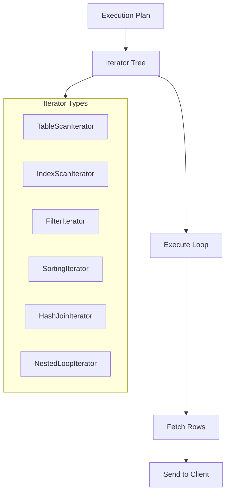
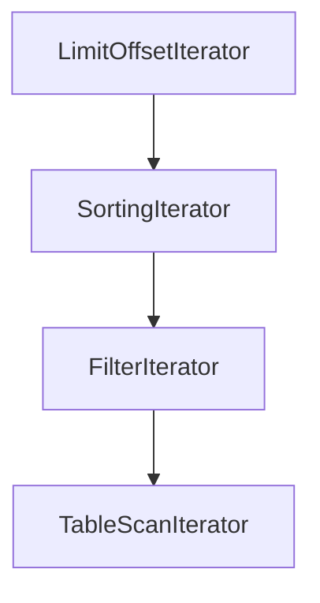
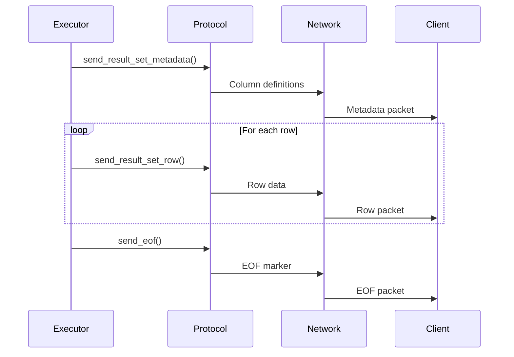
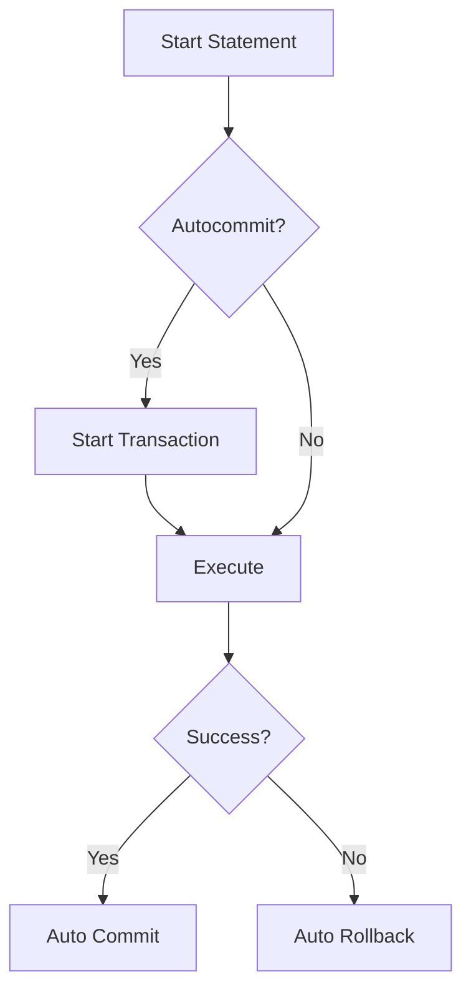

# Giai Đoạn 5: Query Executor (Tháng 7)

## Mục Tiêu
- Hiểu Iterator execution model
- Trace execution của SELECT, INSERT, UPDATE, DELETE
- Hiểu cách result được trả về client

---

## Kiến Trúc Executor



---

## Files Quan Trọng

| File | Chức năng |
|------|-----------|
| `sql/sql_executor.cc` | Execution coordination |
| `sql/sql_select.cc` | SELECT handling |
| `sql/sql_insert.cc` | INSERT handling |
| `sql/sql_update.cc` | UPDATE handling |
| `sql/sql_delete.cc` | DELETE handling |
| `sql/iterators/*.h` | Iterator implementations |
| `sql/sql_union.cc` | UNION handling |

---

## Iterator Execution Model

### Iterator Interface

```cpp
class RowIterator {
public:
    virtual bool Init() = 0;      // Initialize
    virtual int Read() = 0;       // Get next row
    virtual ~RowIterator() {}
};
```

**Return values của Read():**
- `0` - Row available
- `-1` - No more rows
- `1` - Error

### Iterator Types

| Iterator | Chức năng |
|----------|-----------|
| `TableScanIterator` | Full table scan |
| `IndexScanIterator` | Index scan |
| `IndexRangeScanIterator` | Range scan |
| `FilterIterator` | WHERE filtering |
| `SortingIterator` | ORDER BY |
| `LimitOffsetIterator` | LIMIT/OFFSET |
| `HashJoinIterator` | Hash join |
| `NestedLoopIterator` | Nested loop join |
| `AggregateIterator` | GROUP BY aggregation |

### Iterator Tree Example

Query: `SELECT * FROM users WHERE age > 25 ORDER BY name LIMIT 10`



---

## Bài Tập Thực Hành

### Bài 1: Trace SELECT Execution

**Query:**
```sql
SELECT * FROM users WHERE age > 25 ORDER BY name LIMIT 10;
```

**Breakpoints:**
1. `Sql_cmd_select::execute()` - sql/sql_select.cc
2. `Query_expression::execute()` - sql/sql_union.cc
3. `FilterIterator::Read()` - sql/iterators/basic_row_iterators.cc
4. `SortingIterator::Read()` - sql/iterators/sorting_iterator.cc

**Tasks:**
1. Vẽ iterator tree được tạo
2. Trace từng row qua các iterators
3. Xem cách result được gửi về client

### Bài 2: Trace INSERT Execution

**Query:**
```sql
INSERT INTO users (name, age) VALUES ('John', 30);
```

**Breakpoints:**
1. `Sql_cmd_insert::execute()` - sql/sql_insert.cc
2. `write_record()` - sql/sql_insert.cc
3. `handler::ha_write_row()` - sql/handler.cc

**Tasks:**
1. Trace từ SQL đến storage
2. Xem trigger execution (nếu có)
3. Hiểu auto_increment handling

### Bài 3: Trace UPDATE Execution

**Query:**
```sql
UPDATE users SET age = age + 1 WHERE id = 1;
```

**Breakpoints:**
1. `Sql_cmd_update::execute()` - sql/sql_update.cc
2. `Query_result_update::send_data()`
3. `handler::ha_update_row()`

**Tasks:**
1. Trace row read → modify → write
2. Hiểu locking trong update
3. Xem before/after values

### Bài 4: Trace DELETE Execution

**Query:**
```sql
DELETE FROM users WHERE age < 18;
```

**Breakpoints:**
1. `Sql_cmd_delete::execute()` - sql/sql_delete.cc
2. `handler::ha_delete_row()`

**Tasks:**
1. Trace row selection → deletion
2. Hiểu cascading deletes (foreign keys)

---

## Sending Results to Client

### Protocol Layer

**File:** `sql/protocol_classic.cc`

```cpp
class Protocol_classic {
    bool send_result_set_metadata();  // Column info
    bool send_result_set_row();       // Data row
    bool send_eof();                  // End of result
};
```

### Result Flow



---

## Transaction Handling

### Trong Executor

```cpp
bool trans_commit(THD *thd);
bool trans_rollback(THD *thd);
```

### Autocommit Flow



---

## Checklist Cuối Tháng 7

- [ ] Hiểu Iterator pattern
- [ ] Trace được SELECT execution
- [ ] Trace được INSERT/UPDATE/DELETE
- [ ] Hiểu cách result gửi về client
- [ ] Biết transaction handling trong executor
- [ ] Vẽ được iterator tree cho query

---

## Tips Debug Executor

1. **Print iterator tree:**
   ```sql
   EXPLAIN FORMAT=TREE SELECT ...;
   ```

2. **Trace row flow:**
   Đặt breakpoint trong `Read()` của iterator

3. **Check row count:**
   Watch `thd->get_sent_row_count()`

