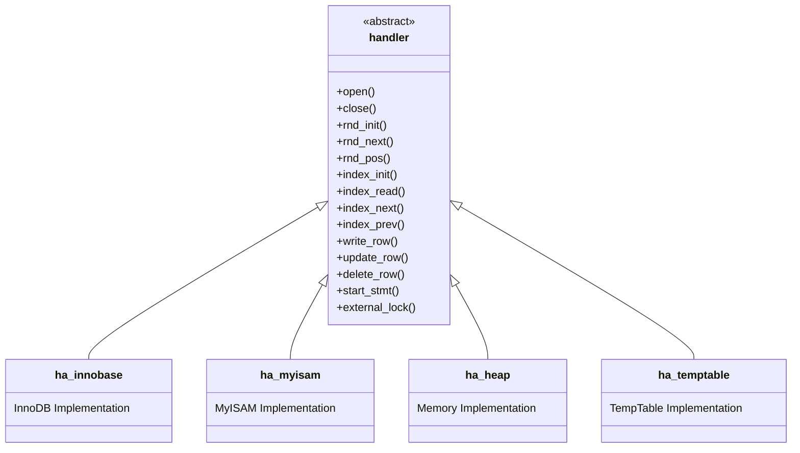
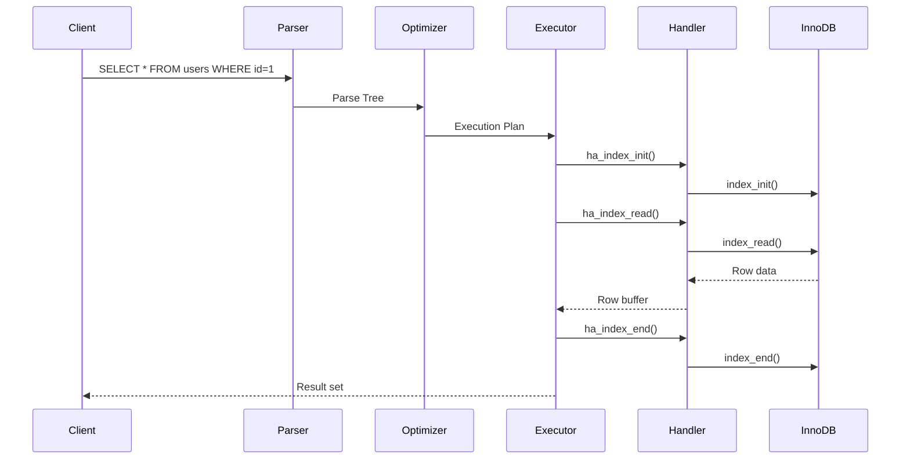

# Giai Đoạn 6: Handler API (Tháng 8)

## Mục Tiêu
- Hiểu Handler API - interface giữa SQL và Storage layers
- Biết các methods chính của handler class
- Trace được call từ SQL xuống Storage Engine

---

## Kiến Trúc Handler



---

## File Quan Trọng

| File | Chức năng |
|------|-----------|
| `sql/handler.h` | Handler interface definition |
| `sql/handler.cc` | Handler base implementation |
| `storage/innobase/handler/ha_innodb.cc` | InnoDB handler |
| `storage/myisam/ha_myisam.cc` | MyISAM handler |
| `storage/heap/ha_heap.cc` | Memory handler |
| `storage/temptable/handler.cc` | TempTable handler |

---

## Handler Methods

### Table Operations

| Method | Chức năng |
|--------|-----------|
| `open()` | Open table |
| `close()` | Close table |
| `create()` | Create table |
| `delete_table()` | Drop table |
| `rename_table()` | Rename table |

### Row Scanning

| Method | Chức năng |
|--------|-----------|
| `rnd_init()` | Initialize full scan |
| `rnd_next()` | Get next row |
| `rnd_pos()` | Get row by position |
| `rnd_end()` | End full scan |

### Index Operations

| Method | Chức năng |
|--------|-----------|
| `index_init()` | Initialize index scan |
| `index_read()` | Read by key value |
| `index_next()` | Next index entry |
| `index_prev()` | Previous index entry |
| `index_first()` | First index entry |
| `index_last()` | Last index entry |
| `index_end()` | End index scan |

### Row Modification

| Method | Chức năng |
|--------|-----------|
| `write_row()` | Insert row |
| `update_row()` | Update row |
| `delete_row()` | Delete row |

### Transaction

| Method | Chức năng |
|--------|-----------|
| `external_lock()` | Lock table |
| `start_stmt()` | Start statement |
| `store_lock()` | Store lock |

---

## Bài Tập Thực Hành

### Bài 1: Trace Full Table Scan

**Query:**
```sql
SELECT * FROM users;
```

**Breakpoints:**
1. `handler::ha_rnd_init()` - sql/handler.cc
2. `ha_innobase::rnd_init()` - storage/innobase/handler/ha_innodb.cc
3. `handler::ha_rnd_next()` - sql/handler.cc
4. `ha_innobase::rnd_next()` - storage/innobase/handler/ha_innodb.cc

**Tasks:**
1. Đếm số lần `rnd_next()` được gọi
2. Xem row buffer content
3. Trace đến InnoDB internals

### Bài 2: Trace Index Scan

**Query:**
```sql
SELECT * FROM users WHERE id = 1;
```

**Breakpoints:**
1. `handler::ha_index_init()`
2. `handler::ha_index_read_map()`
3. `ha_innobase::index_read()`

**Tasks:**
1. Xem index được chọn
2. Trace key lookup trong InnoDB
3. So sánh với full scan

### Bài 3: Trace Insert

**Query:**
```sql
INSERT INTO users (name, age) VALUES ('Alice', 25);
```

**Breakpoints:**
1. `handler::ha_write_row()` - sql/handler.cc
2. `ha_innobase::write_row()` - InnoDB
3. Trong InnoDB: `row_insert_for_mysql()`

**Tasks:**
1. Xem row format trước khi insert
2. Trace auto_increment handling
3. Xem index update

### Bài 4: Trace Update

**Query:**
```sql
UPDATE users SET age = 30 WHERE id = 1;
```

**Breakpoints:**
1. `handler::ha_update_row()`
2. `ha_innobase::update_row()`

**Tasks:**
1. Xem old_row vs new_row
2. Trace index update (nếu indexed column thay đổi)
3. Hiểu MVCC trong update

### Bài 5: Compare Storage Engines

Tạo table với các engines khác nhau:
```sql
CREATE TABLE test_innodb (id INT, name VARCHAR(100)) ENGINE=InnoDB;
CREATE TABLE test_myisam (id INT, name VARCHAR(100)) ENGINE=MyISAM;
CREATE TABLE test_memory (id INT, name VARCHAR(100)) ENGINE=MEMORY;
```

**Tasks:**
1. Trace cùng một query trên 3 engines
2. So sánh implementation của `rnd_next()`
3. So sánh locking behavior

---

## Handler Flags

```cpp
class handler {
    ulong m_lock_type;     // Lock level
    uint active_index;     // Current index
    ha_rows stats.records; // Row count estimate
    // ...
};
```

### Table Flags

| Flag | Ý nghĩa |
|------|---------|
| `HA_NO_TRANSACTIONS` | Engine không hỗ trợ transactions |
| `HA_CAN_INDEX_BLOBS` | Có thể index BLOB columns |
| `HA_PRIMARY_KEY_REQUIRED_FOR_DELETE` | Cần PK để delete |
| `HA_STATS_RECORDS_IS_EXACT` | Row count chính xác |

---

## Tổng Hợp SQL Layer

### Luồng Hoàn Chỉnh



---

## Bài Tập Tổng Hợp

Viết tài liệu chi tiết về luồng xử lý query sau:
```sql
SELECT * FROM users WHERE age > 25 ORDER BY name LIMIT 10
```

**Yêu cầu:**
1. Vẽ sơ đồ từ client đến storage
2. List tất cả functions được gọi
3. Giải thích mỗi bước
4. Include handler methods

---

## Checklist Cuối Tháng 8

- [ ] Hiểu handler interface
- [ ] Biết các methods chính
- [ ] Trace được table scan
- [ ] Trace được index scan
- [ ] Trace được insert/update/delete
- [ ] So sánh được các storage engines
- [ ] Hoàn thành tài liệu tổng hợp SQL layer

