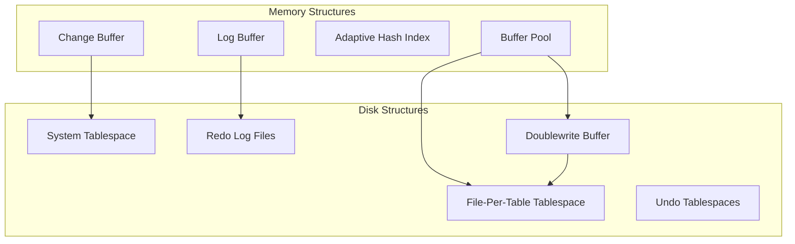
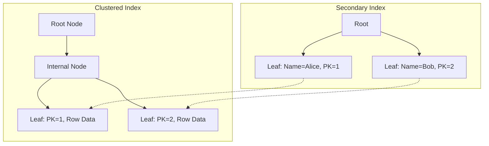
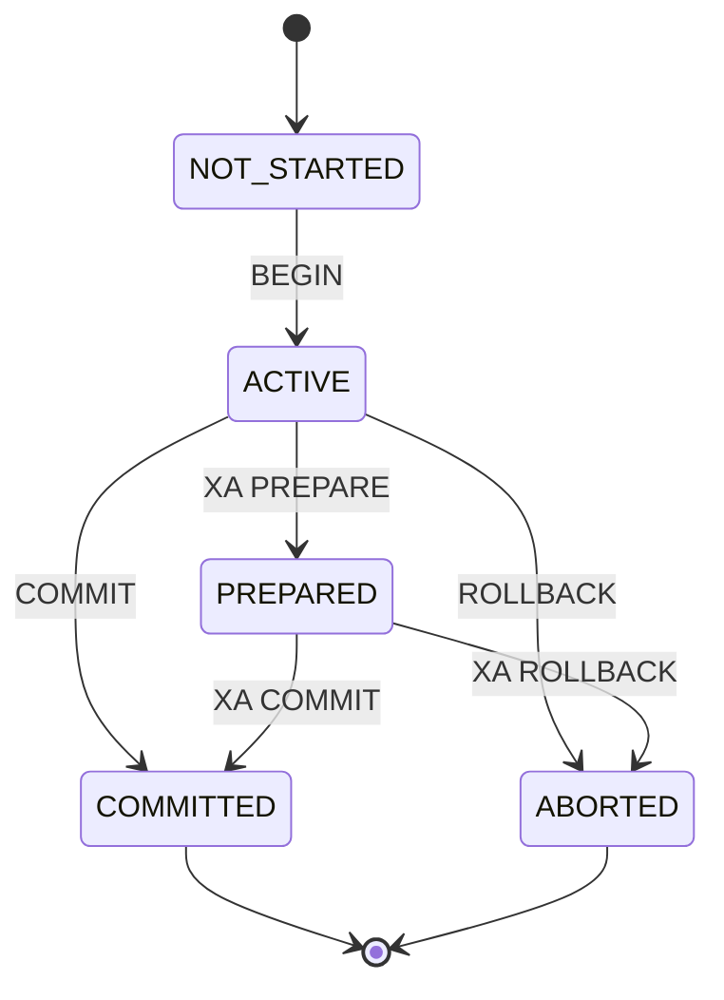
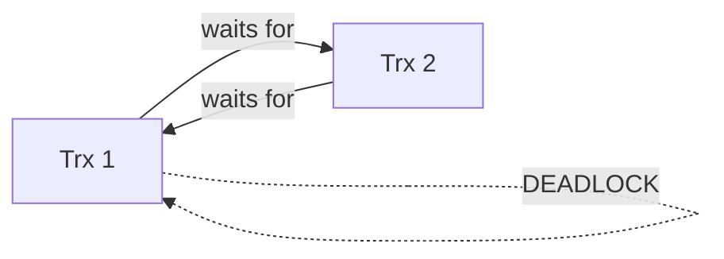

# Giai Đoạn 7: InnoDB Deep Dive (Tháng 9-10)

## Mục Tiêu
- Hiểu kiến trúc InnoDB engine
- Nắm vững Buffer Pool, B+Tree, MVCC
- Trace được transaction và crash recovery

---

## Kiến Trúc InnoDB



---

## Thư Mục: `storage/innobase/`

| Thư mục | Chức năng |
|---------|-----------|
| `buf/` | Buffer Pool management |
| `page/` | Page handling |
| `btr/` | B+Tree implementation |
| `row/` | Row operations |
| `dict/` | Data dictionary |
| `fil/` | File management |
| `trx/` | Transaction system |
| `lock/` | Lock manager |
| `log/` | Redo logging |
| `mtr/` | Mini-transaction |
| `read/` | MVCC read view |

---

## Tháng 9: InnoDB Fundamentals

### 1. Buffer Pool

**Files:** `storage/innobase/buf/`
- `buf0buf.cc` - Buffer pool implementation
- `buf0lru.cc` - LRU algorithm
- `buf0flu.cc` - Flush operations

**Cấu trúc:**
```cpp
struct buf_pool_t {
    buf_page_t *page_hash;   // Hash table for pages
    UT_LIST_BASE_NODE_T(buf_page_t) LRU;    // LRU list
    UT_LIST_BASE_NODE_T(buf_page_t) flush_list;  // Dirty pages
    // ...
};
```

**Khái niệm quan trọng:**
- LRU list: Old/Young sublists
- Flush list: Dirty pages chờ write
- Free list: Empty pages
- Page eviction algorithm

**Bài tập:**
1. Trace page read từ disk vào buffer pool
2. Xem LRU replacement
3. Trace dirty page flush

### 2. Page Structure

**Files:** `storage/innobase/page/`

**Page format (16KB):**
```
+------------------+
| File Header (38) |
+------------------+
| Page Header (56) |
+------------------+
| Infimum Record   |
+------------------+
| Supremum Record  |
+------------------+
| User Records     |
| ...              |
+------------------+
| Free Space       |
+------------------+
| Page Directory   |
+------------------+
| File Trailer (8) |
+------------------+
```

**Page types:**
| Type | Ý nghĩa |
|------|---------|
| `FIL_PAGE_INDEX` | B+Tree node |
| `FIL_PAGE_UNDO_LOG` | Undo log |
| `FIL_PAGE_INODE` | Segment inode |
| `FIL_PAGE_FSP_HDR` | Tablespace header |

### 3. B+Tree Index

**Files:** `storage/innobase/btr/`
- `btr0btr.cc` - B+Tree operations
- `btr0cur.cc` - Cursor operations
- `btr0sea.cc` - Adaptive hash index

**Clustered Index:**
- Primary key = Row location
- Leaf nodes chứa full row data

**Secondary Index:**
- Leaf nodes chứa (key, primary key)
- Cần lookup lại clustered index



**Bài tập:**
1. Trace INSERT vào B+Tree
2. Observe page split
3. Trace secondary index lookup

### 4. Row Format

**Formats:**
| Format | Đặc điểm |
|--------|----------|
| COMPACT | Default trước 5.7 |
| DYNAMIC | Default từ 5.7 |
| COMPRESSED | Compressed storage |
| REDUNDANT | Legacy format |

**Row structure (DYNAMIC):**
```
+----------------+
| Variable-length header |
| NULL bitmap    |
| Column 1       |
| Column 2       |
| ...            |
+----------------+
```

---

## Tháng 10: InnoDB Advanced

### 1. Transaction System

**Files:** `storage/innobase/trx/`
- `trx0trx.cc` - Transaction handling
- `trx0sys.cc` - Transaction system

**Transaction states:**


**Transaction structure:**
```cpp
struct trx_t {
    trx_id_t id;          // Transaction ID
    trx_state_t state;    // Current state
    ReadView *read_view;  // MVCC read view
    undo_no_t undo_no;    // Undo log position
    // ...
};
```

### 2. MVCC (Multi-Version Concurrency Control)

**Files:** `storage/innobase/read/`

**Read View:**
```cpp
class ReadView {
    trx_id_t m_low_limit_id;   // Highest trx at view creation
    trx_id_t m_up_limit_id;    // Lowest active trx
    ids_t m_ids;               // Active transaction IDs
};
```

**Visibility check:**
```
if (trx_id < m_up_limit_id) → Visible
if (trx_id >= m_low_limit_id) → Not visible
if (trx_id in m_ids) → Not visible
else → Visible
```

**Bài tập:**
1. Trace read view creation
2. Test với 2 concurrent transactions
3. Observe undo log traversal

### 3. Redo Logging

**Files:** `storage/innobase/log/`
- `log0log.cc` - Redo log management
- `log0recv.cc` - Crash recovery

**Redo log structure:**
```
+--------+--------+--------+
| Log 0  | Log 1  | Log 2  |  (circular)
+--------+--------+--------+
```

**Write flow:**
1. Change data in buffer pool
2. Write redo log record to log buffer
3. Flush log buffer to disk (on commit)
4. Later: Flush dirty pages to data files

**WAL (Write-Ahead Logging):**
- Redo log PHẢI được persist trước data pages
- Đảm bảo crash recovery

**Bài tập:**
1. Trace commit và redo log write
2. Simulate crash và observe recovery
3. Xem checkpoint mechanism

### 4. Undo Logging

**Files:** `storage/innobase/trx/trx0undo.cc`

**Undo log purposes:**
- Rollback transactions
- MVCC - build old versions
- Crash recovery

**Undo record types:**
| Type | Ý nghĩa |
|------|---------|
| INSERT | Stores PK for delete on rollback |
| UPDATE | Stores old column values |
| DELETE | Stores full row for restore |

### 5. Lock Manager

**Files:** `storage/innobase/lock/`
- `lock0lock.cc` - Lock implementation

**Lock types:**
| Lock | Ý nghĩa |
|------|---------|
| Record lock | Lock single row |
| Gap lock | Lock gap between records |
| Next-key lock | Record + gap lock |
| Insert intention | For INSERT |

**Deadlock detection:**


**Bài tập:**
1. Create deadlock scenario
2. Trace lock wait
3. Observe deadlock detection

---

## Bài Tập Tổng Hợp InnoDB

### Trace Full INSERT Flow
```sql
INSERT INTO users (id, name) VALUES (1, 'Alice');
```

**Trace points:**
1. SQL layer → handler
2. Handler → row0ins.cc
3. B+Tree insert
4. Undo log creation
5. Redo log write
6. Commit

### Trace Transaction
```sql
BEGIN;
UPDATE users SET name = 'Bob' WHERE id = 1;
COMMIT;
```

**Observe:**
1. Read view creation
2. Old version in undo
3. Lock acquisition
4. Redo log on commit

---

## Checklist Cuối Tháng 10

- [ ] Hiểu Buffer Pool architecture
- [ ] Hiểu Page structure
- [ ] Trace được B+Tree operations
- [ ] Hiểu MVCC và Read View
- [ ] Hiểu Redo/Undo logging
- [ ] Hiểu Lock types
- [ ] Trace được full transaction flow

