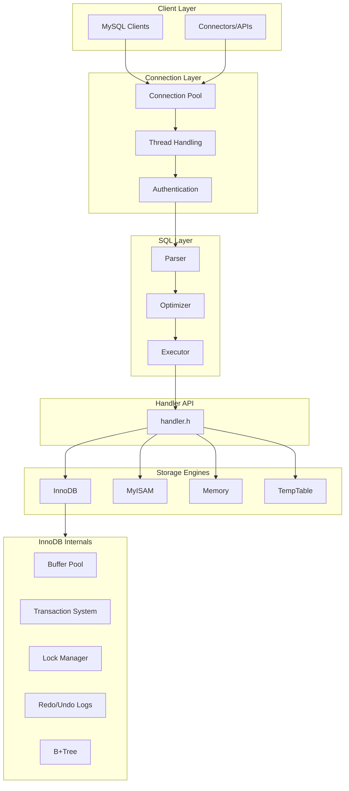

# Giai Đoạn 9: Tổng Hợp và Dự Án Cuối Khóa (Tháng 12)

## Mục Tiêu
- Tổng hợp toàn bộ kiến thức đã học
- Hoàn thành dự án tài liệu kỹ thuật
- Thuyết trình và demo

---

## Tổng Hợp Kiến Trúc MySQL Server



---

## Query Execution Summary

### SELECT Flow
```
Client → Connection → Parser → Optimizer → Executor
    → Handler::index_read/rnd_next → Storage Engine
    → Return rows → Send to Client
```

### INSERT Flow
```
Client → Connection → Parser → Executor
    → Handler::write_row → Storage Engine
    → Update indexes → Redo log → Commit
```

### UPDATE Flow
```
Client → Parser → Optimizer (find rows) → Executor
    → Read row → Lock → Modify → Handler::update_row
    → Old version to Undo → Redo log → Commit
```

### Transaction Flow (InnoDB)
```
BEGIN → Assign trx_id → Execute statements
    → Build undo log → Write redo log
    → COMMIT → Persist redo → Release locks
```

---

## Dự Án Cuối Khóa

### Yêu Cầu

Viết tài liệu kỹ thuật chi tiết (20-30 trang) về MySQL Server internals.

### Cấu Trúc Đề Xuất

#### 1. Giới Thiệu (2-3 trang)
- MySQL Server overview
- Kiến trúc tổng quan
- Cấu trúc source code

#### 2. SQL Layer (6-8 trang)
- Parser: Lexer, Bison grammar
- Optimizer: Cost model, access paths
- Executor: Iterator model
- Handler API

#### 3. Storage Engines (8-10 trang)

**InnoDB:**
- Buffer Pool architecture
- B+Tree implementation
- MVCC và Read View
- Transaction và Locking
- Redo/Undo logging

**Other engines:**
- MyISAM đặc điểm
- Memory engine
- TempTable

#### 4. Case Study (4-6 trang)

Trace chi tiết một transaction phức tạp:
```sql
BEGIN;
SELECT * FROM accounts WHERE id = 1 FOR UPDATE;
UPDATE accounts SET balance = balance - 100 WHERE id = 1;
UPDATE accounts SET balance = balance + 100 WHERE id = 2;
COMMIT;
```

**Include:**
- Mỗi bước trong flow
- Functions được gọi
- Data structures involved
- Lock acquisition/release
- Log records

#### 5. Kết Luận (1-2 trang)
- Lessons learned
- Areas for further study
- Recommendations

### Format Yêu Cầu

- PDF hoặc Markdown
- Diagrams (Mermaid, draw.io)
- Code snippets với comments
- Screenshots debug sessions
- References

---

## Presentation

### Thời Lượng
30-45 phút + 15 phút Q&A

### Nội Dung

#### Part 1: Overview (10 phút)
- MySQL architecture
- Query flow
- Storage engines comparison

#### Part 2: Deep Dive (15 phút)
Chọn 1 topic để deep dive:
- SQL Parser internals, HOẶC
- Query Optimizer, HOẶC
- InnoDB transactions

#### Part 3: Demo (10 phút)
Live debug session:
- Trace một query từ đầu đến cuối
- Show breakpoints và call stack
- Explain key data structures

#### Part 4: Q&A (15 phút)

### Tips Presentation

1. **Biết audience**: Technical level của listeners
2. **Visual aids**: Diagrams > Text
3. **Live demo**: Chuẩn bị kỹ, có backup
4. **Time management**: Practice trước
5. **Q&A prep**: Anticipate common questions

---

## Self-Assessment Checklist

### C/C++ Foundation
- [ ] Hiểu pointers, memory management
- [ ] Sử dụng được STL containers
- [ ] Hiểu OOP, virtual functions
- [ ] Debug được memory issues

### MySQL Build
- [ ] Build được từ source
- [ ] Chạy được local server
- [ ] Debug được với IDE

### SQL Layer
- [ ] Trace được query parsing
- [ ] Hiểu optimizer decisions
- [ ] Trace được executor flow
- [ ] Hiểu handler interface

### Storage Engines
- [ ] Hiểu InnoDB architecture
- [ ] Trace được B+Tree operations
- [ ] Hiểu MVCC
- [ ] Hiểu transaction logging
- [ ] So sánh được các engines

### Overall
- [ ] Vẽ được architecture diagrams
- [ ] Giải thích được query flow
- [ ] Debug được issues
- [ ] Viết được technical documentation

---

## Gợi Ý Tiếp Theo

### Nếu Muốn Đi Sâu Hơn

1. **Replication**: `sql/rpl_*`, `storage/innobase/log/`
2. **Group Replication**: `plugin/group_replication/`
3. **Query Optimizer**: Advanced topics (histograms, window functions)
4. **Performance Schema**: `storage/perfschema/`
5. **InnoDB Internals**: Compression, encryption

### Tài Liệu Nâng Cao

- MySQL Source Code Documentation
- InnoDB Source Code Documentation
- MySQL Internals Manual
- Planet MySQL (blogs)

### Contribute

- MySQL Bug Database
- Community contributions
- Documentation improvements

---

## Timeline Tháng 12

| Tuần | Công Việc |
|------|-----------|
| 1 | Outline tài liệu, collect materials |
| 2 | Viết SQL Layer section |
| 3 | Viết Storage Engines section |
| 4 | Case study, review, presentation |

---

## Kết Luận

Sau 12 tháng, bạn đã có:
1. Hiểu biết sâu về MySQL Server internals
2. Khả năng đọc và debug large C++ codebase
3. Kiến thức về database systems
4. Kỹ năng viết technical documentation
5. Kinh nghiệm presentation

**Chúc mừng bạn hoàn thành chương trình!**

