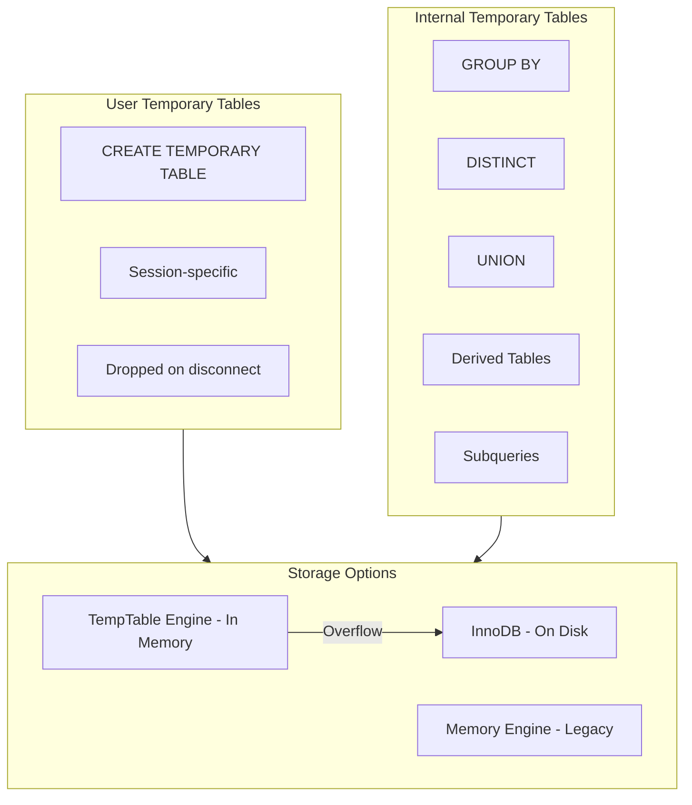
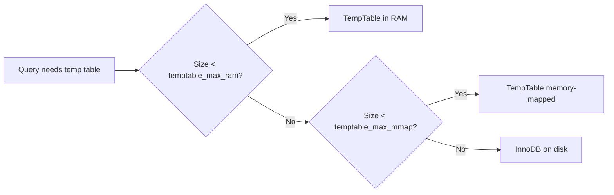

# Chủ Đề Đặc Biệt: Temporary Tables (Bảng Tạm)

## Tổng Quan

Temporary tables trong MySQL được chia thành 2 loại chính:
1. **User-created temporary tables**: Tạo bởi `CREATE TEMPORARY TABLE`
2. **Internal temporary tables**: Tạo tự động bởi optimizer

---

## Kiến Trúc Temporary Tables



---

## Files Quan Trọng

| File | Chức năng |
|------|-----------|
| `sql/sql_tmp_table.cc` | Temporary table creation |
| `sql/sql_tmp_table.h` | Temp table definitions |
| `sql/sql_derived.cc` | Derived tables handling |
| `sql/sql_union.cc` | UNION temp tables |
| `storage/temptable/` | TempTable engine |
| `storage/heap/` | Memory engine (legacy) |

---

## 1. User-Created Temporary Tables

### Cú Pháp
```sql
CREATE TEMPORARY TABLE temp_users (
    id INT,
    name VARCHAR(100),
    INDEX idx_id (id)
);

CREATE TEMPORARY TABLE temp_copy AS
SELECT * FROM users WHERE status = 'active';
```

### Đặc Điểm
- Chỉ visible trong session tạo nó
- Tự động drop khi session kết thúc
- Có thể cùng tên với table thường (shadow)
- Mặc định dùng InnoDB (có thể specify engine)

### Trace Points

**Breakpoints:**
1. `mysql_create_table()` - sql/sql_table.cc
2. `create_tmp_table_def()` - sql/sql_tmp_table.cc

**Bài tập:**
```sql
CREATE TEMPORARY TABLE temp1 (id INT);
SHOW CREATE TABLE temp1;
-- Trace: Xem temp table được lưu ở đâu
```

---

## 2. Internal Temporary Tables

### Khi Nào MySQL Tạo Internal Temp Tables

| Scenario | Ví dụ |
|----------|-------|
| GROUP BY với columns không có index | `SELECT dept, COUNT(*) FROM emp GROUP BY dept` |
| ORDER BY và GROUP BY khác columns | `SELECT dept, COUNT(*) FROM emp GROUP BY dept ORDER BY COUNT(*)` |
| DISTINCT với ORDER BY | `SELECT DISTINCT name FROM users ORDER BY created_at` |
| UNION queries | `SELECT a FROM t1 UNION SELECT b FROM t2` |
| Derived tables | `SELECT * FROM (SELECT ...) AS derived` |
| Subqueries trong SELECT | `SELECT (SELECT MAX(x) FROM t2)` |
| Window functions | `SELECT ROW_NUMBER() OVER(...)` |

### Kiểm Tra Temp Table Usage

```sql
EXPLAIN SELECT department, COUNT(*) 
FROM employees 
GROUP BY department;
```

Tìm trong Extra column:
- `Using temporary` - Có dùng temp table
- `Using filesort` - Có sort (có thể dùng temp table)

### Monitor Temp Tables

```sql
SHOW STATUS LIKE 'Created_tmp%';
```

| Variable | Ý nghĩa |
|----------|---------|
| `Created_tmp_tables` | Tổng số temp tables đã tạo |
| `Created_tmp_disk_tables` | Số temp tables phải dùng disk |

---

## 3. TempTable Engine

### Thư mục: `storage/temptable/`

| File | Chức năng |
|------|-----------|
| `handler.cc` | Handler implementation |
| `table.cc` | Table operations |
| `row.cc` | Row handling |
| `index.cc` | Index structures |
| `allocator.cc` | Memory management |
| `block.cc` | Memory blocks |

### Đặc Điểm TempTable
- Default engine cho internal temp tables (MySQL 8.0+)
- Variable-length rows (tối ưu memory)
- Hash và B-Tree indexes
- Memory-efficient allocator
- Tự động overflow sang disk (InnoDB)

### Configuration

```sql
-- Memory limit cho TempTable
SET GLOBAL temptable_max_ram = 1073741824;  -- 1GB

-- Memory-mapped file limit (overflow)
SET GLOBAL temptable_max_mmap = 1073741824; -- 1GB

-- Check giá trị hiện tại
SHOW VARIABLES LIKE 'temptable%';
```

### Overflow Mechanism



---

## 4. Bài Tập Thực Hành

### Bài 1: Observe Temp Table Creation

```sql
SET optimizer_trace = 'enabled=on';

SELECT department, AVG(salary)
FROM employees
GROUP BY department
HAVING AVG(salary) > 50000;

SELECT * FROM information_schema.optimizer_trace\G
```

**Tìm trong trace:**
- `creating_tmp_table`
- `location` (memory vs disk)
- `row_limit_estimate`

### Bài 2: Force Disk Temp Table

```sql
SET temptable_max_ram = 1048576;  -- 1MB

-- Large query sẽ overflow sang disk
SELECT * FROM large_table GROUP BY col1, col2, col3;

SHOW STATUS LIKE 'Created_tmp_disk_tables';
```

### Bài 3: Trace Internal Temp Table Creation

**Breakpoints:**
1. `create_tmp_table()` - sql/sql_tmp_table.cc
2. `instantiate_tmp_table()` - sql/sql_tmp_table.cc
3. `ha_temptable::create()` - storage/temptable/handler.cc

**Query:**
```sql
SELECT department, COUNT(*) as cnt
FROM employees
GROUP BY department
ORDER BY cnt DESC;
```

### Bài 4: Compare Temp Table Engines

```sql
-- Force Memory engine (legacy)
SET internal_tmp_mem_storage_engine = MEMORY;

-- Chạy query và check status
SELECT ...;
SHOW STATUS LIKE 'Created_tmp%';

-- Switch back to TempTable
SET internal_tmp_mem_storage_engine = TempTable;
```

### Bài 5: Trace Row Operations

**Breakpoints:**
1. `ha_temptable::write_row()` - Insert vào temp table
2. `ha_temptable::rnd_next()` - Scan temp table
3. `ha_temptable::index_read()` - Index lookup

---

## 5. Optimization Tips

### Tránh Temp Tables Không Cần Thiết

```sql
-- BAD: Cần temp table
SELECT DISTINCT name FROM users ORDER BY created_at;

-- BETTER: Có thể dùng index
SELECT name FROM users 
GROUP BY name 
ORDER BY MAX(created_at);
```

### Index để Tránh Temp Tables

```sql
-- Tạo composite index
CREATE INDEX idx_dept_salary ON employees(department, salary);

-- Query có thể dùng index, không cần temp table
SELECT department, AVG(salary)
FROM employees
GROUP BY department;
```

### Monitor và Tune

```sql
-- Nếu nhiều disk temp tables, tăng RAM
SHOW STATUS LIKE 'Created_tmp_disk_tables';

-- Tăng memory nếu cần
SET GLOBAL temptable_max_ram = 2147483648;  -- 2GB
```

---

## 6. Internal Implementation

### Temp Table Structure

```cpp
struct TABLE_SHARE {
    bool tmp_table;              // Is temporary
    enum tmp_table_type {
        NO_TMP_TABLE,
        NON_TRANSACTIONAL_TMP_TABLE,
        TRANSACTIONAL_TMP_TABLE,
        INTERNAL_TMP_TABLE
    } tmp_table_type;
};
```

### Creation Flow

```mermaid
sequenceDiagram
    participant Opt as Optimizer
    participant TmpMgr as Temp Table Manager
    participant Engine as TempTable/InnoDB
    
    Opt->>TmpMgr: Need temp table
    TmpMgr->>TmpMgr: Estimate size
    TmpMgr->>TmpMgr: Choose engine
    TmpMgr->>Engine: create()
    Engine-->>TmpMgr: Table handle
    
    loop For each row
        Opt->>Engine: write_row()
    end
    
    loop Read results
        Opt->>Engine: rnd_next()
    end
    
    Opt->>Engine: drop()
```

---

## Checklist

- [ ] Hiểu 2 loại temp tables (user vs internal)
- [ ] Biết khi nào MySQL tạo internal temp tables
- [ ] Trace được temp table creation
- [ ] Hiểu TempTable engine
- [ ] Biết cách monitor temp table usage
- [ ] Biết cách optimize để tránh disk temp tables

